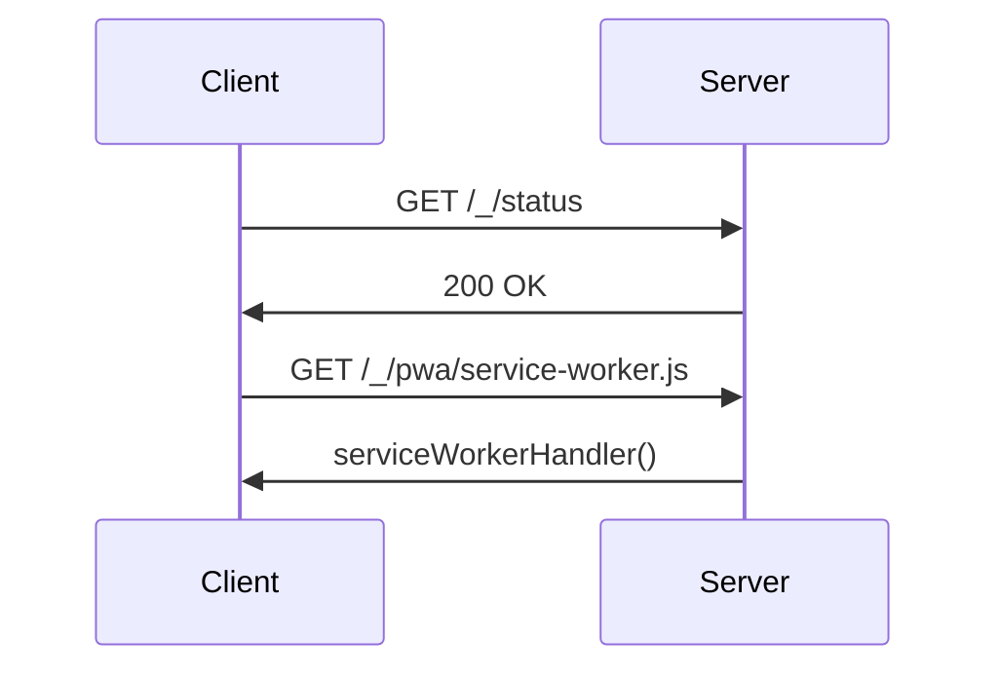

The SSR (Server Side Rendering) server in this project is implemented using Fastify, a web framework for Node.js. It is responsible for rendering the initial HTML of the application on the server side before sending it to the client. This approach improves the performance of the application by reducing the time to first paint and enhancing SEO. The server is configured with various plugins for handling requests, responses, and application-specific logic. It also includes error handling and logging mechanisms.

<SwmSnippet path="/src/server/ssrServer.js" line="251">

---

# SSR Server Setup

The `createApp` function is where the Fastify server is set up. It configures the server with various options, registers the `appPlugin` which sets up the routes and plugins, and then returns the ready-to-use Fastify instance.

```javascript
export async function createApp(opts = {}) {
  const fastify = Fastify({
    logger,
    disableRequestLogging: true,
    frameworkErrors: function frameworkErrors(error, request, reply) {
      const { method, url, headers } = request;
      const correlationId = headers['correlation-id'];

      request.log.error('Fastify internal error: method %s, url "%s", correlationId "%s"', method, url, correlationId, error);

      renderStaticErrorPage(request, reply);
      return reply;
    },
    bodyLimit: bytes(process.env.ONE_MAX_POST_REQUEST_PAYLOAD || '10mb'), // Note: this applies to all routes
    ...opts,
  });

  fastify.register(appPlugin);

  await fastify.ready();

```

---

</SwmSnippet>

<SwmSnippet path="/src/server/ssrServer.js" line="252">

---

# SSR Server Configuration

The server is configured with various options such as a custom logger, request body limit, and a custom error handler. These options can be customized as per the requirements of the application.

```javascript
  const fastify = Fastify({
    logger,
    disableRequestLogging: true,
    frameworkErrors: function frameworkErrors(error, request, reply) {
      const { method, url, headers } = request;
      const correlationId = headers['correlation-id'];

      request.log.error('Fastify internal error: method %s, url "%s", correlationId "%s"', method, url, correlationId, error);

      renderStaticErrorPage(request, reply);
      return reply;
    },
    bodyLimit: bytes(process.env.ONE_MAX_POST_REQUEST_PAYLOAD || '10mb'), // Note: this applies to all routes
    ...opts,
  });
```

---

</SwmSnippet>

<SwmSnippet path="/src/server/ssrServer.js" line="57">

---

# SSR Server Routes and Plugins

The `appPlugin` function is where all the routes and plugins for the server are registered. This includes static routes, error reporting routes, and various plugins for handling cookies, metrics, compression, and more.

```javascript
async function appPlugin(fastify) {
  if (process.env.OTEL_EXPORTER_OTLP_TRACES_ENDPOINT || argv.logLevel === 'trace') {
    fastify.register(fastifyOpenTelemetry, { wrapRoutes: true, propagateToReply: true });
  } else {
    fastify.register(noopTracer);
  }
  if (!process.env.OTEL_EXPORTER_OTLP_TRACES_ENDPOINT || process.env.ONE_ENABLE_REQUEST_LOGGING_WHILE_TRACING === 'true') {
    fastify.register(requestLogging, { spy: true });
  }
  fastify.register(requestRaw);
  fastify.register(fastifySensible);
  fastify.register(ensureCorrelationId);
  fastify.register(fastifyCookie);
  fastify.register(fastifyMetrics, {
    defaultMetrics: { enabled: false },
    endpoint: null,
    promClient: client,
  });

  fastify.register(compress, {
    zlibOptions: {
```

---

</SwmSnippet>

<SwmSnippet path="/__tests__/server/ssrServer.spec.js" line="95">

---

# SSR Server Testing

The SSR server is tested in the `ssrServer.spec.js` file. The tests ensure that the server is set up correctly, the plugins are registered in the correct order, and the routes respond as expected.

```javascript
describe('ssrServer', () => {
  const mockFastifyInstance = {
    register: jest.fn(async (plugin) => {
      plugin(mockFastifyInstance, {}, jest.fn());
    }),
    setNotFoundHandler: jest.fn(),
    setErrorHandler: jest.fn(),
    ready: jest.fn(),
    addContentTypeParser: jest.fn(),
    decorateRequest: jest.fn(),
    addHook: jest.fn(),
    get: jest.fn(),
    post: jest.fn(),
  };
  const {
    setNotFoundHandler,
    setErrorHandler,
    ready,
    get,
    post,
    register,
```

---

</SwmSnippet>

# SSR Server Functions

This section will cover the main functions of the SSR server in the DEMO-one-app repository.

<SwmSnippet path="/src/server/ssrServer.js" line="50">

---

## nodeEnvIsDevelopment

The `nodeEnvIsDevelopment` function checks if the current Node.js environment is set to 'development'. This function is used to conditionally apply certain behaviors in development mode.

```javascript
const nodeEnvIsDevelopment = () => process.env.NODE_ENV === 'development';

```

---

</SwmSnippet>

<SwmSnippet path="/src/server/ssrServer.js" line="57">

---

## appPlugin

The `appPlugin` function is responsible for registering all the plugins and routes for the Fastify app. It configures various plugins like OpenTelemetry, request logging, cookie handling, metrics, compression, form body parsing, and security headers. It also sets up static routes and content type parsers.

```javascript
async function appPlugin(fastify) {
  if (process.env.OTEL_EXPORTER_OTLP_TRACES_ENDPOINT || argv.logLevel === 'trace') {
    fastify.register(fastifyOpenTelemetry, { wrapRoutes: true, propagateToReply: true });
  } else {
    fastify.register(noopTracer);
  }
  if (!process.env.OTEL_EXPORTER_OTLP_TRACES_ENDPOINT || process.env.ONE_ENABLE_REQUEST_LOGGING_WHILE_TRACING === 'true') {
    fastify.register(requestLogging, { spy: true });
  }
  fastify.register(requestRaw);
  fastify.register(fastifySensible);
  fastify.register(ensureCorrelationId);
  fastify.register(fastifyCookie);
  fastify.register(fastifyMetrics, {
    defaultMetrics: { enabled: false },
    endpoint: null,
    promClient: client,
  });

  fastify.register(compress, {
    zlibOptions: {
```

---

</SwmSnippet>

<SwmSnippet path="/src/server/ssrServer.js" line="251">

---

## createApp

The `createApp` function creates a Fastify app with built-in routes and configuration. It sets up the Fastify instance with the necessary options, registers the `appPlugin`, and makes the app ready for incoming connections.

```javascript
export async function createApp(opts = {}) {
  const fastify = Fastify({
    logger,
    disableRequestLogging: true,
    frameworkErrors: function frameworkErrors(error, request, reply) {
      const { method, url, headers } = request;
      const correlationId = headers['correlation-id'];

      request.log.error('Fastify internal error: method %s, url "%s", correlationId "%s"', method, url, correlationId, error);

      renderStaticErrorPage(request, reply);
      return reply;
    },
    bodyLimit: bytes(process.env.ONE_MAX_POST_REQUEST_PAYLOAD || '10mb'), // Note: this applies to all routes
    ...opts,
  });

  fastify.register(appPlugin);

  await fastify.ready();

```

---

</SwmSnippet>

# Server Endpoints

Understanding Server Endpoints

<SwmSnippet path="/src/server/ssrServer.js" line="100">

---

## /\_/status Endpoint

The '/\_/status' endpoint is a simple health check endpoint. When a GET request is made to this endpoint, it responds with a 200 status code and sends 'OK' as the response body. This can be used to monitor the health of the server.

```javascript
  fastify.get('/_/status', (_request, reply) => reply.status(200).send('OK'));
```

---

</SwmSnippet>

<SwmSnippet path="/src/server/ssrServer.js" line="101">

---

## /\_/pwa/service-worker.js Endpoint

The '/\_/pwa/service-worker.js' endpoint is used to serve the service worker file for Progressive Web Apps (PWA). When a GET request is made to this endpoint, the 'serviceWorkerHandler' function is called, which serves the service worker file.

```javascript
  fastify.get('/_/pwa/service-worker.js', serviceWorkerHandler);
```

---

</SwmSnippet>



&nbsp;

*This is an auto-generated document by Swimm AI 🌊 and has not yet been verified by a human*

<SwmMeta version="3.0.0" repo-id="Z2l0aHViJTNBJTNBREVNTy1vbmUtYXBwJTNBJTNBZ2lsYWRuYXZvdA==" repo-name="DEMO-one-app" doc-type="overview"><sup>Powered by [Swimm](/)</sup></SwmMeta>
