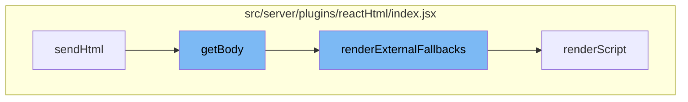

This document will cover the process of rendering HTML in the One App framework, which includes:

1. The initiation of the HTML rendering process
2. The construction of the HTML body
3. The rendering of external fallbacks
4. The rendering of scripts.



<SwmSnippet path="/src/server/plugins/reactHtml/index.jsx" line="1">

---

# The initiation of the HTML rendering process

The `sendHtml` function initiates the HTML rendering process. It's the entry point for the rendering flow.

```javascript
/*
 * Copyright 2019 American Express Travel Related Services Company, Inc.
 *
 * Licensed under the Apache License, Version 2.0 (the "License");
 * you may not use this file except in compliance with the License.
 * You may obtain a copy of the License at
 *
 * http://www.apache.org/licenses/LICENSE-2.0
 *
 * Unless required by applicable law or agreed to in writing, software
```

---

</SwmSnippet>

<SwmSnippet path="/src/server/plugins/reactHtml/index.jsx" line="249">

---

# The construction of the HTML body

The `getBody` function is responsible for constructing the HTML body. It takes several parameters including `isLegacy`, `helmetInfo`, `renderMode`, `assets`, `appHtml`, `appBundlesURLPrefix`, `clientInitialState`, `disableScripts`, `clientModuleMapCache`, `scriptNonce`, `pwaMetadata`, and `request`. These parameters are used to construct the HTML body which includes the root div, initial state script, environment variables, i18n script, external fallbacks, module scripts, and the app script.

```javascript
export function getBody({
  isLegacy,
  helmetInfo,
  renderMode,
  assets,
  appHtml,
  appBundlesURLPrefix,
  clientInitialState,
  disableScripts,
  clientModuleMapCache,
  scriptNonce,
  pwaMetadata,
  request,
}) {
  const bundle = isLegacy ? 'legacyBrowser' : 'browser';
  const { bodyAttributes, script } = helmetInfo;
  const bundlePrefixForBrowser = isLegacy ? `${appBundlesURLPrefix}/legacy` : appBundlesURLPrefix;
  const nonce = scriptNonce ? `nonce="${scriptNonce}"` : '';
  return `
    <body${(bodyAttributes && ` ${bodyAttributes.toString()}`) || ''}>
      <div id="root">${appHtml || ''}</div>
```

---

</SwmSnippet>

<SwmSnippet path="/src/server/plugins/reactHtml/index.jsx" line="117">

---

# The rendering of external fallbacks

The `renderExternalFallbacks` function is responsible for rendering external fallbacks. It takes `clientInitialState`, `moduleMap`, and `isDevelopmentEnv` as parameters and returns a string of script tags for each required external fallback.

```javascript
export function renderExternalFallbacks({
  clientInitialState,
  moduleMap,
  isDevelopmentEnv,
}) {
  const loadedModules = clientInitialState.getIn(['holocron', 'loaded'], iSet()).toArray();
  const requiredFallbacks = loadedModules
    .reduce((externals, moduleName) => {
      const externalsMap = externals.reduce((obj, { name, version }) => ({
        ...obj,
        [name]: version,
      }), {});
      const requiredExternals = getRequiredExternals(moduleName)
        .filter(
          ({ name, version }) => !externalsMap[name] || externalsMap[name].version !== version
        );

      return [
        ...externals,
        ...requiredExternals,
      ];
```

---

</SwmSnippet>

<SwmSnippet path="/src/server/plugins/reactHtml/index.jsx" line="80">

---

# The rendering of scripts

The `renderScript` function is responsible for rendering scripts. It takes `src`, `integrity`, `isDevelopmentEnv`, and `clientCacheRevision` as parameters and returns a script tag with the provided src and integrity attributes.

```javascript
function renderScript({
  src, integrity, isDevelopmentEnv, clientCacheRevision,
}) {
  if (!integrity && !isDevelopmentEnv) console.warn(`No SRI integrity hash found for script ${src}. This is a security risk.`);
  // TODO: consider throwing an error in next major version. This is a breaking change.
  // currently we rely on "undefined" to throw integrity error in the browser, this is
  // results in poor DX, hard to find bugs.
  const additionalAttributes = isDevelopmentEnv ? '' : `integrity="${integrity}"`;
  const scriptSource = isDevelopmentEnv || !clientCacheRevision
    ? src
    : `${src}?clientCacheRevision=${clientCacheRevision}`;
  return `<script src="${scriptSource}" crossorigin="anonymous" ${additionalAttributes}></script>`;
}
```

---

</SwmSnippet>

&nbsp;

*This is an auto-generated document by Swimm AI 🌊 and has not yet been verified by a human*

<SwmMeta version="3.0.0" repo-id="Z2l0aHViJTNBJTNBREVNTy1vbmUtYXBwJTNBJTNBZ2lsYWRuYXZvdA==" repo-name="DEMO-one-app" doc-type="flows"><sup>Powered by [Swimm](/)</sup></SwmMeta>
