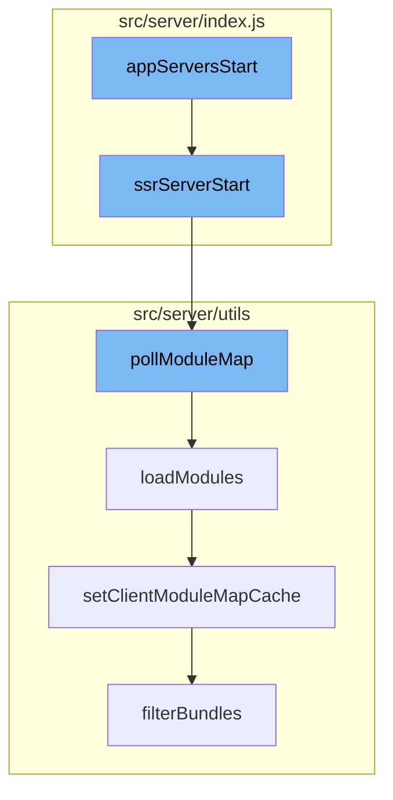

This document will cover the process of starting the One App server and loading modules, which includes:

1. Starting the server-side rendering (SSR) server
2. Polling the module map
3. Loading modules
4. Setting the client module map cache
5. Filtering bundles.



<SwmSnippet path="/src/server/index.js" line="73">

---

# Starting the SSR Server

The function `ssrServerStart` is the entry point for starting the server. It first loads the modules, then starts the server listening on the specified port. After the server has started, it begins polling the module map.

```javascript
async function ssrServerStart() {
  // need to load _some_ locale so that react-intl does not prevent modules from loading
  Intl.__addLocaleData(enData);

  await loadModules();

  const isHttps = !!process.env.HTTPS_PORT;
  const port = isHttps ? process.env.HTTPS_PORT : process.env.HTTP_PORT || 3000;

  await listen({
    context: '🌎 One App server',
    instance: await ssrServer({
      https: isHttps ? getHttpsConfig() : null,
    }),
    host: process.env.IP_ADDRESS,
    port,
  });

  await pollModuleMap();

  if (process.env.OTEL_EXPORTER_OTLP_LOGS_ENDPOINT) {
```

---

</SwmSnippet>

<SwmSnippet path="/src/server/utils/pollModuleMap.js" line="123">

---

# Polling the Module Map

The function `pollModuleMap` is responsible for polling the module map. It increments a counter for each poll, loads the modules, and then checks if any modules were rejected or require a fallback. If any modules were loaded or rejected, it resets the poll time, otherwise it increments the poll time.

```javascript
async function pollModuleMap() {
  // record module map poll first to reduce risk that polling monitor
  // triggers additional poll during current poll.
  recordPollingForMonitor();
  startPollingMonitorIfNotAlready();
  try {
    console.log('pollModuleMap: polling...');
    incrementCounter(holocronMetrics.moduleMapPoll);

    const { loadedModules = {}, rejectedModules = {} } = await loadModules();

    const numberOfModulesLoaded = Object.keys(loadedModules).length;
    const numberOfModulesRejected = Object.keys(rejectedModules).length;
    const numberOfModulesRequiringFallback = Object.keys(getRequiredExternalsRegistry()).length;
    setGauge(holocronMetrics.rejectedModules, numberOfModulesRejected);
    setGauge(holocronMetrics.modulesRequiringFallbacks, numberOfModulesRequiringFallback);

    moduleMapHealthy = !numberOfModulesRejected;

    if (numberOfModulesLoaded) {
      console.log('pollModuleMap: %d modules loaded/updated:\n%o', numberOfModulesLoaded, loadedModules);
```

---

</SwmSnippet>

<SwmSnippet path="/src/server/utils/loadModules.js" line="32">

---

# Loading Modules

The function `loadModules` fetches the module map from the specified URL, adds a base URL to the module map, and then updates the module registry. If any modules were loaded, it sets the client module map cache.

```javascript
const loadModules = async () => {
  const moduleMapResponse = await fetch(process.env.HOLOCRON_MODULE_MAP_URL);
  const moduleMap = addBaseUrlToModuleMap(await moduleMapResponse.json());

  const moduleMapHash = hash(moduleMap);
  if (cachedModuleMapHash && cachedModuleMapHash === moduleMapHash) {
    return { loadedModules: {}, rejectedModules: rejectedModulesCache };
  }
  cachedModuleMapHash = moduleMapHash;
  const serverConfig = getServerStateConfig();
  // NOTE:: this function mutates the moduleMap
  const { loadedModules = {}, rejectedModules = {} } = await updateModuleRegistry({
    moduleMap,
    batchModulesToUpdate,
    onModuleLoad,
    getModulesToUpdate,
    listRejectedModules: true,
  });

  rejectedModulesCache = rejectedModules;
  const loadedModuleNames = Object.keys(loadedModules);
```

---

</SwmSnippet>

<SwmSnippet path="/src/server/utils/clientModuleMapCache.js" line="36">

---

# Setting the Client Module Map Cache

The function `setClientModuleMapCache` sets the client module map cache with the filtered bundles for the browser and legacy browser.

```javascript
export function setClientModuleMapCache(moduleMap) {
  cache = {
    browser: filterBundles(moduleMap, 'browser'),
    legacyBrowser: filterBundles(moduleMap, 'legacyBrowser'),
  };
}
```

---

</SwmSnippet>

<SwmSnippet path="/src/server/utils/clientModuleMapCache.js" line="21">

---

# Filtering Bundles

The function `filterBundles` filters the bundles in the module map based on the module bundle type. It returns a new module map with the filtered bundles.

```javascript
function filterBundles(moduleMap, moduleBundleType) {
  return {
    ...moduleMap,
    modules: Object.entries(moduleMap.modules).reduce((acc, [moduleName, moduleBundles]) => (
      {
        ...acc,
        [moduleName]: {
          baseUrl: moduleBundles[moduleBundleType].url.replace(/[^/]+\.js$/i, ''),
          [moduleBundleType]: moduleBundles[moduleBundleType],
        },
      }
    ), {}),
  };
}
```

---

</SwmSnippet>

&nbsp;

*This is an auto-generated document by Swimm AI 🌊 and has not yet been verified by a human*

<SwmMeta version="3.0.0" repo-id="Z2l0aHViJTNBJTNBREVNTy1vbmUtYXBwJTNBJTNBZ2lsYWRuYXZvdA==" repo-name="DEMO-one-app" doc-type="flows"><sup>Powered by [Swimm](/)</sup></SwmMeta>
